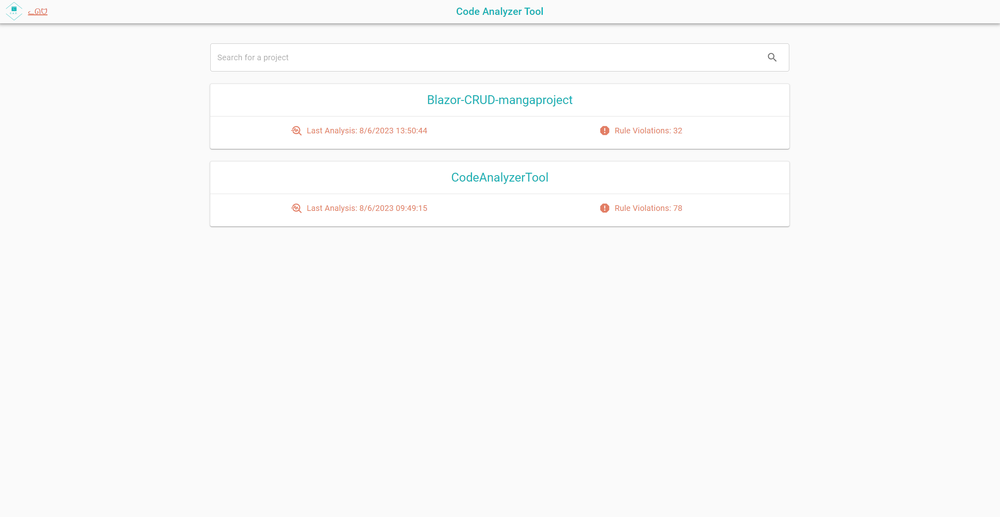
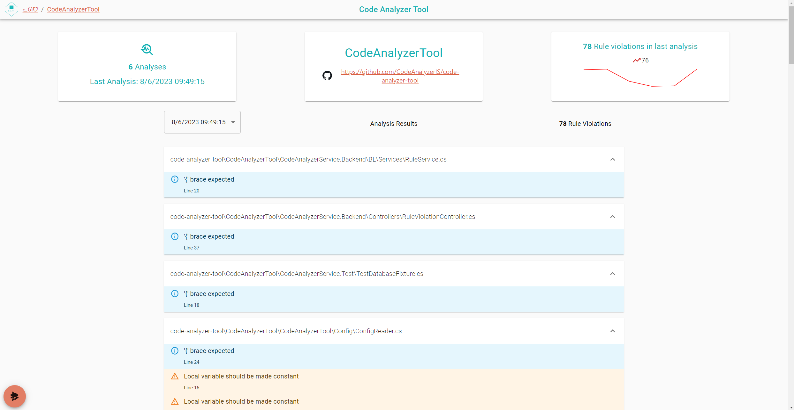

# Code Analyzer Tool (CAT)    

This is a custom-made code analyzer tool that can analyze source code and identify code smells or other potential issues.  
This tool is created with a plugin architecture to allow the user to add his own plugins which can analyze different languages or files.  
We have added a built-in plugin that analyzes C# Code based on some built in rules, but you can always add more custom rules yourself.

## Features

- [x] Plugin system for extending language support
- [x] Expandable ruleset for built-in C# plugin (Roslyn)
- [x] Configurable through a config file
- [x] Analysis runnable through CI/CD pipeline
    - [x] Github Action Available for easy setup in Github workflow

## License

This project is licensed under the MIT License. See the [LICENSE](LICENSE) file for details.
